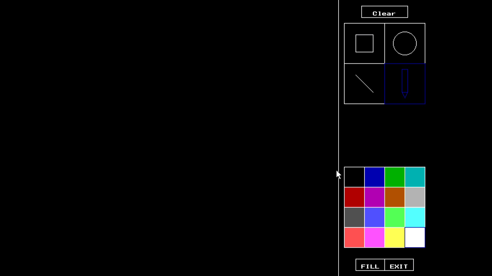
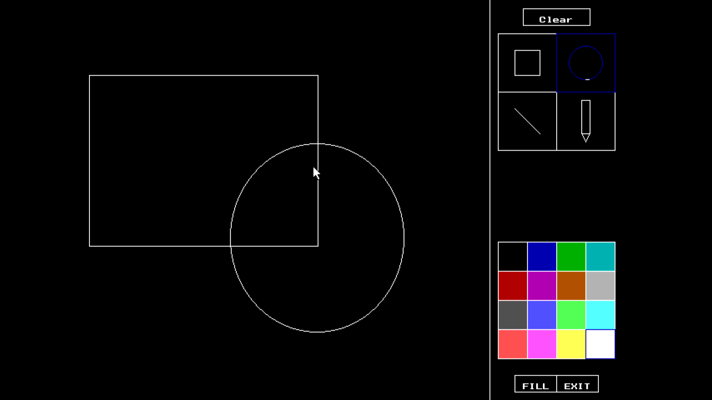
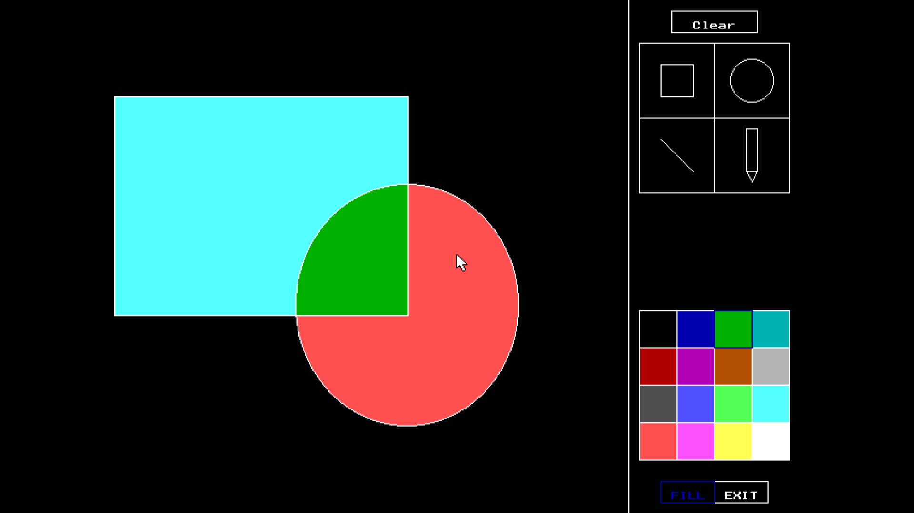
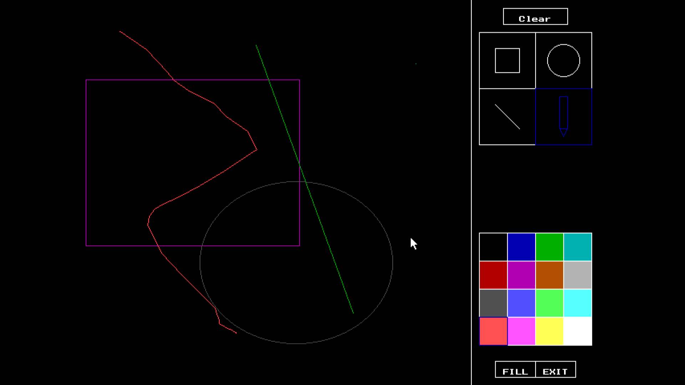

# Paint
This is Repo of Paint clone done as Computer Graphics Project in S.E.
Developed By Vatsal Soni,Yashodhan Joshi and Yatharth Vyas.
## Details
This project is done in C/C++ graphics.h library.
We have used mouse programming and the graphics library to make a clone of MS-paint.

Things User can do:
* Draw standard shpaed reactangle, square, circle, ellipse, lines and even random shapes.
* Change the default color and choose the color from the palette provided.
* Can also fill colors inside shapes.
## Images 

